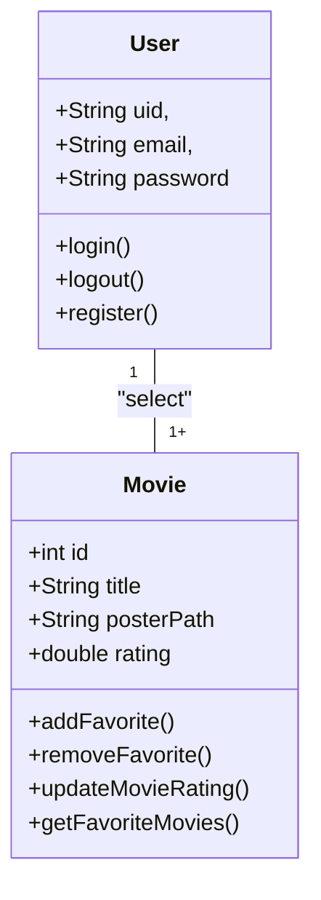
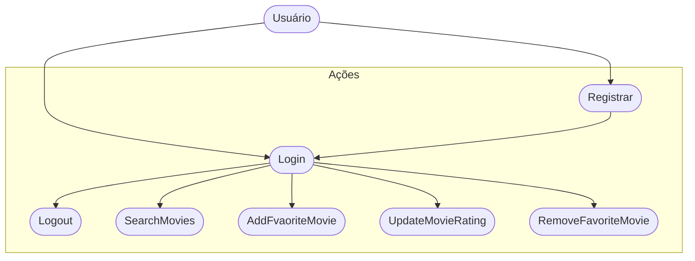
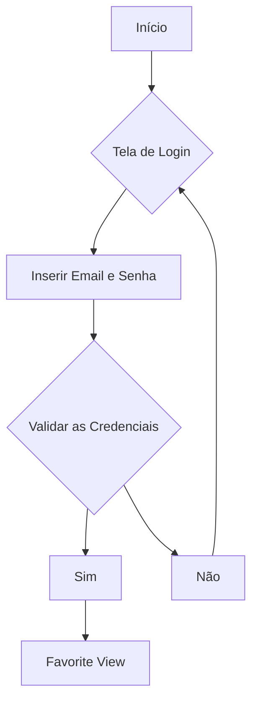

# CineFavorite (Formativa)

## Briefing
Construir um Aplicativo do Zero - O CineFavorite que permitirá criar uma conte e buscar filmes em uma API, montar uma galeria pessoal de filmes favoritos, com poster(capa) e nota avaliativa do usuário para o filme.

## Objetivos
- Criar uma Galeria Personalizada por Usuário de Filmes Favoritos
- Buscar Filmes em uma API e Listar para selecionar filmes favoritos
- Criação de Contas por Usuário
- Listar filmes por Palavra-Chave

## Levantamento de Requistos
- ### Funcionais
    - Cadastro de usuário – permitir que o usuário crie uma conta com email e senha.
    - Login/Logout – autenticar usuário no app e possibilitar sair da conta.
    - Buscar filmes – consultar a API do TMDB usando palavras-chave.
    - Listar filmes – exibir os resultados da pesquisa com título e poster.
    - Favoritar filmes – usuário pode salvar filmes em sua galeria pessoal.
    - Dar nota a filmes – usuário pode avaliar cada filme favorito com uma nota.
    - Editar nota – usuário pode atualizar a avaliação de um filme já favoritado.
    - Remover favoritos – usuário pode excluir filmes da sua galeria.
    - Visualizar galeria pessoal – exibir todos os filmes favoritos do usuário.

- ### Não Funcionais
    - Conversão de JSON da API em objetos internos (Movie)
    - Armazenamento de dados no Firestore (CRUD de favoritos)
    - Autenticação de usuários pelo Firebase Auth
    - Persistência de sessão local (manter login ativo)
    - Tratamento de erros e exceções sem travar o app
    - Organização em camadas (models, services, views)
    - Sincronização em tempo real com Firestore

## Recurso do Projeto
- Linguagem de Programação: Flutter/Dart
- API TMDB: Base de Dados para Filmes
- Figma: Prototipagem
- GitHub: para Armazenamento e Versionamento do Código
- FireBase: Authentication / FireStore DB
- VsCode: Codificação / Teste

## Diagramas
1. ### Classe: 
Demosntrar o Funcionamento das Entidades do Sistema
- Usuário (User): Classe já modelada pelo FireBaseAuth
    - Atributos: email, senha, uid
    - Métodos: login, registrar, logout

- Filmes Favoritos (Movie): Classe Modelada pelo DEV - Baseada na API TMDB
    - Atributos: id, título, PosterPath, Nota
    - Métodos: Adicionar, remover, listar, atualizatNota (CRUD)

2. ## uso
Ação que os Atores podem fazer 
- Usuário
    - Registrar 
    - Login 
    - Logout 
    - Procurar Filmes na API
    - Salvar Filmes aos Favoritos 
    - Dar Nota aos Filmes Favoritos
    - Remover Filmes dos Favoritos 

3. ### Fluxo
Determinar o Caminho Percorrido pelo Ator para executar uma Ação

- Fluxo da Ação de Login

# Prototipagem
https://www.figma.com/proto/2oVvCxfIQQQtIIiUwqijln/Untitled?node-id=0-1&t=JKoPliSTenTIQXv8-1
